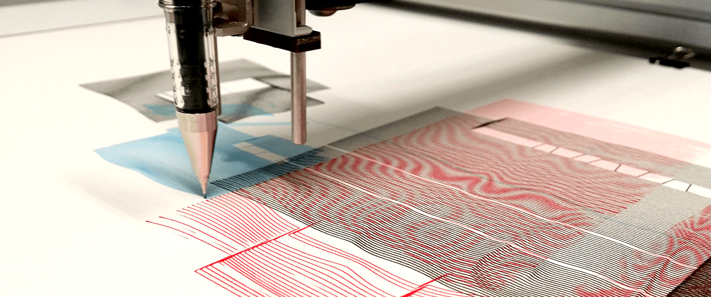

# py5-techweek

*Resources for Techweek workshop on pen-plotting weaving-inspired designs with Python*

Event details: https://techweek.co.nz/whats-on/programme/view/pen-plotting-weaving-inspired-designs-with-python-67

## Session materials and activities

Here are the files for each task:

* **Task 1: Drawing with py5** -- [01-drawing.py](https://github.com/tabreturn/py5-techweek/blob/main/tasks/01-drawing.py)
* **Task 2: Weaving Template** -- [02-template.py](https://github.com/tabreturn/py5-techweek/blob/main/tasks/02-template.py)

Here are the slides for the session intro [./slides.odp](./slides.odp) (OpenDocument presentation format).

If you're looking for a more advanced follow-on to this session, you can watch the *Virtual CC Fest 2022* session on [Generating SVG for Pen Plotters using Python](https://github.com/tabreturn/cc-fest-plotter).

## Resources for py5

"py5 is a new version of Processing for Python 3.8+. It makes the Java Processing jars available to the CPython interpreter using JPype. It can do just about everything Processing can do, except with Python instead of Java code."

* [py5 cheatsheet](https://raw.githubusercontent.com/tabreturn/processing.py-cheat-sheet/master/py5/py5_cc.pdf)
* [py5 documentation](http://py5.ixora.io/)
* [py5 discussions](https://github.com/hx2A/py5generator/discussions)
* [thonny-py5mode plug-in](https://github.com/tabreturn/thonny-py5mode)

The [Processing forum](https://discourse.processing.org/c/processing-py/9) is also great for help with anything Processing + Python related.

## Useful plotter utilities

A handy (but hardly complete) list of useful software for working with plotter art files:

* [Beardicus' Awesome Plotters list](https://github.com/beardicus/awesome-plotters)  
  curated resources for computer-controlled drawing machines and other visual art robots
* [Msurguy's 3d-engines-for-plotters list](https://github.com/msurguy/awesome-3d-engines-for-plotters)  
  links to awesome 3D SVG exporters
* [occult](https://github.com/LoicGoulefert/occult)  
  vpype plug-in to remove lines occulted by polygons from SVG files
* [plotter.vision](https://plotter.vision/)  
  upload 3D STL files, interactively position them, then render them as SVG
* [Processing Geometry Suite](https://github.com/micycle1/PGS)  
  2D geometric algorithms in the form of a Processing library
* [UJI](https://doersino.github.io/uji/)  
  a minimalist generative art thing; press the buttons and play with the sliders
* [vpype](https://github.com/abey79/vpype)  
  the Swiss-Army-knife command-line tool for plotter vector graphics
* [vsketch](https://github.com/abey79/vsketch)  
  a Python generative art toolkit for plotters

I recommend exploring [drawingbots.net](https://drawingbots.net/), which is on a mission "to become the central place on the web to discover the world of drawing robots, get inspiration, and talk to other drawing robot enthusiasts."

## Plotter-art inspiration

A few (of the many) artists creating inspiring plotter art --

[Antoine Beyeler](https://github.com/abey79/sketches) · [Binaura](https://www.binaura.net/) · [Gábor Ugray](https://jealousmarkup.xyz/plots/) · [Iskra Velitchkova](http://iskraovelitchkova.com/works.html) · [Jakob Glock](https://github.com/JakobGlock/Generative-Art) · [Julien Espagnon](https://www.instagram.com/julien_espagnon/) · [Julien Gachadoat](http://www.v3ga.net/) · [Matthis Grunsky](https://www.matthisgrunsky.ca/) · [Michael Fogleman](https://www.michaelfogleman.com/plotter/) · [Sean Puckett](https://plotterprints.square.site/s/shop) · [Sohan Murthy](https://sohan.space/) · [thedotisblack](https://thedotisblack.com/)

The [Anne and Michael Spalter Digital Art Collection](https://spalterdigital.com/) includes plotter artwork from several groundbreaking artists (Vera Molnar, Frieder Nake, Georg Nees, ...)

Also, check Twitter for [#plottertwitter](https://twitter.com/search?q=%2523plottertwitter) and [#py5](https://twitter.com/search?q=%2523py5).

## Other useful resources

Other useful plotter and Python creative coding resources:

* [Villares' comprehensive list of resources](https://github.com/villares/Resources-for-teaching-programming#user-content-processing--python-tools-table) for teaching programming for artists, designers, and architects
* [PlotterFiles](https://plotterfiles.com/) hosts free SVG files for plotters and drawing robots

[Learn Python Visually](https://nostarch.com/Learn-Python-Visually) is a book based on [Processing.py](https://py.processing.org/), but it should be relatively straightforward to adapt the content for py5. Everything `camelCase` switches to `snake_case` -- so, `colorMode()` becomes `color_mode()`, and so forth. The book's [official resources](https://github.com/tabreturn/processing.py-book) include all of the code examples and solutions.
